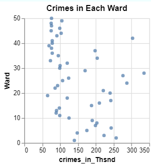
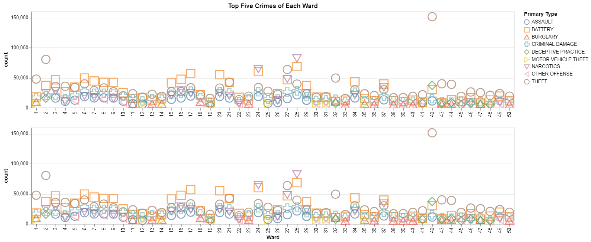

# visualWebsite
This will house the repo that will make a website for 424
The group that made this project is EE (Erick Gonzalez and Emily Perez)

Website Link: https://wsbtm95.github.io/visualWebsite/

The dataset that is being used is from Chicago Data Portal of Chicago Crimes from 2001 
to the present date. The dataset contains the types of crime, dates, location, ward number, 
if there was an arrest, if the crime was domestic abuse, etc. 

An important note about this dataset is that it can be updated so the more recent data may 
not be as accurate because it can still be updated. Additionally, domestic crimes are not 
considered a type of crime because of the Domestic Violence Prevention and Services 
Act,1980. This act provides the help people need when the crime is domestic, but the 
crime itself is more specific. Therefore, the dataset has a column where it checks if the 
crime is domestic or not; it is as shown as true or false. 

When we first started to work with the dataset, we found that recordings of crime had 
been lowering after around 2010 when we thought it would rise. Yet, along with the 
information that shows the number of arrests made with the number of crimes reported, 
we began to question if the recording of crime was indeed lowering perhaps because of 
laws or other factors that go with the actions of dealing accordingly with each crime or if 
perhaps people did not report crimes that exist for reasons unknown. Yet, we continued 
with the other questions that were previously submitted as this question would require 
further research that would be more time consuming and take away the focus of the 
general dataset that we want to learn from.

In order to transform the data, we cleaned the data so there was no null data and we can 
keep the data that is useful to use in the visualizations. After we cleaned the data, we 
renamed some of the columns and the dataset so it would be easier to call and encode. We 
also searched for examples of how to encode and transform the data with VegaLite. Once 
we found examples that were useful to us, we used the templates to fit the visualizations 
we wanted to create. Overall for the colors with the graphs on the Statics graphs page, we 
chose blue as it is a color that is easier to see and for the heatmaps, either green or red 
was used as again, they are easier for people to see. If the question we wanted to answer 
had to do with change over time, we would use a linear graph as that graph shows change 
over time the best. All else could be used with bar graphs if we wanted to show quantity. 
In general, when it came to showing data with the wards of Chicago, we used what made 
sense when comparing two numbers, such as a count and ID, and matching an amount to 
a ward as one would with matching a count to a distinct ID. Overall, the spatial graph is 
the best way to show data with wards as it helps a person put a visual to the ward number. 

The interactions of the visualizations will be in the captions of the screenshots of the 
visualizations below. The interactions were made by searching for templates of how to use VegaLite. 
The captions of the screenshots will appear on the website 

Statics Graphs 

The visualization shows the pattern of the amount of crimes per year since the initial recording of the data. There is a legend on the side that matches a hue of blue to a year. There has always been crime as it shows that no year is skipped in the graph. If you hover over the slices of the pie chart, you can see the total count of crime per year and will notice that the amount of crime fluctuates over time; there was more crime counted in the early 2000s and began to lower after 2008. 

The visualization shows the total arrests made (per 10,000) per type of crime. More questions could arise from this visualization such as if there is a correlation between a type of crime and a number of arrests made. 
If you hover over the bars you can see the specific count of how many arrests were made. You can see that the highest amount of arrests is for narcotics and the lowest is for homicide. 

This visualization shows the amount of crime (per thousand) in each ward. This is a preview to a spatial visual where you could see specifically where in Chicago the wards are located, so it would be easier to understand where the wards are located. This is to see if there is more crime occurring in certain wards which could be used to compare where the arrests are being made to know if the crimes are being dealt with accordingly.
You can hover over the dots to see the specific amount of crime (per thousand) as well as the specific ward where the crime occurred.

This visualization shows the count of crimes per month in the year of 2022. The main reason for the creation of this graph was to see if there was a time of year where crime occurs more. Initially it appears as if the amount of crime does not fluctuate a lot and stays around the same number throughout the year but upon closer inspection, you can see that there is more crime in the month of October and the lowest amount of crime is in February. An inference can be made that the holidays of October and February are a cause for their respective amount of crime. Another notable month is June and August, it could just be a coincidence or perhaps since the weather is warmer, it allows more crime to be done rather in the winter where the weather can get to a dangerous temperature. 
You can hover over the bars to see the specific amount of crime per month. 

A further inspection of the Crimes per month in 2022 is shown here as besides the total amount of crime per month, the specific type of crime per month is shown for each month throughout the year of 2022.  You can see that the main types of crimes are theft and battery. A legend is on the side of the visualization showing the mean of the amount of crimes. By showing the mean, you can see a more accurate visual of which crimes are committed most. You can hover over the boxes to see the month, the specific type of crime as well as the count of that crime.

This visualization shows the linear change of crimes over time since the initial recording date of the data. Since there are so many types of crimes in the data, you see the top type of crime so the visualization is easier to comprehend. 
Something important to note is that the visualization gives the illusion that there was no crime in 2001, but that is because that was the year that the data started to be recorded. It could be that the data was recorded later in the year which would explain why the visual makes it seem as if there was no crime during that year.
This visual shows a more specific view of what the Crime per Year shows at the top of the page. This visualization further shows that there was more crime recorded in the early 2000s as mentioned before and there is a consistent decline in the crime that’s recorded, even if the data shows slight fluctuation. There is a notable change in 2020 that is most likely due to the lockdown. 

Dynamic Graphs

This interactive visualization shows a similar story as the Change of Specific Crime Over the Years visualization on the Static Graphs page. Besides the general amount of crime, Domestic Crimes Over the Years also shows if the crime contains crimes that were domestic cases. The legend on the side is to show if the domestic case is true or false as that is how it is represented in the dataset. You can hover over the circle to see the total amount of crime recorded that year.
Crime Breakdown For the Year of undefined For undefined Cases shows the count of each type of crime for all years as the way that you can see a specific year would be by clicking on one of the circles from Change of Specific Crime Over the Years and then you will see that the title changes to the year and true or false, depending on what you click. You will see how the data changes based on the year of your choosing. The count of each type of crime will appear at the end of the bar.

This visualization shows the top five crimes of each ward. The legend is on the side to see which symbol matches one of the crimes; you will notice that the legend has more than five crimes but not all wards have the same type of crime. If you click on a symbol on either of the graphs, the opposite graph will only show that symbol so you can see which wards have that crime as part of their top five crime list. If you hover over the symbol then you will see the count of that crime as well as type of crime.

For these interactive visualizations, you can click on a box of the heatmap in order to see the count of that crime in that specific month; the title will change with the respective information. You have seen heat maps of how much crime has occurred over time in the Statics Graphs page but now you can see how much of that crime was reported throughout a year of your choosing. Use the scroll at the bottom of the visualization to choose a year to see if more crimes are reported or not over the years. You can also hover over the boxes to see the month, type of crime, and the count of that crime.

Heatmap of the Number of Reported Crimes per Ward in A Range of Years shows how many reports were made, per ward, in a given range of years of your choosing. You can choose the year by using the sliding bars, so you can choose which year to start and which year to end. Additionally, you can choose a specific type of crime in the drop-down box. This visualization shows the patterns of number of arrests for a year and ward. For example, you can see that certain crimes were reported more in the early 2000s and were not reported as much in the later and more recent years. Yet other crimes such as assault remain mostly consistent since the initial recording date of the data.
The way that this visualization interacts with  Location of the Ward Undefined is that when you click on a box of the heatmap, the respective ward will be highlighted in red on the map of Chicago. This allows for you to make the connection of what type of crime you are seeing with the specific location in Chicago. By now you have seen multiple visualizations of crimes with wards and now you can better visualize that information.
